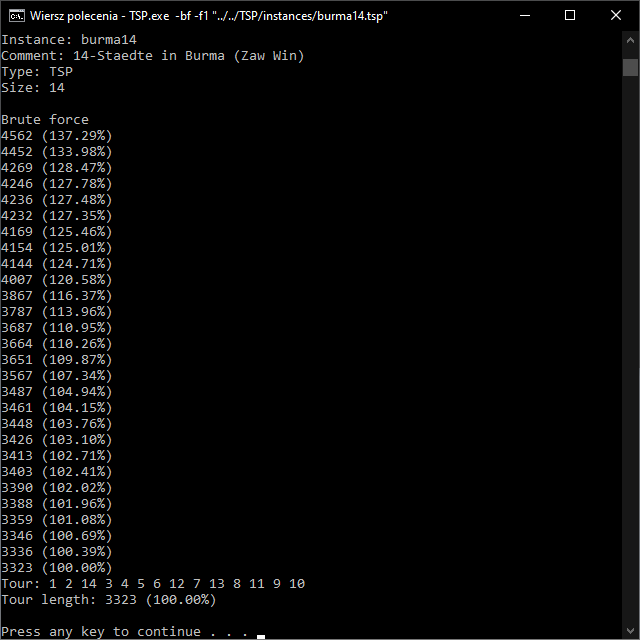
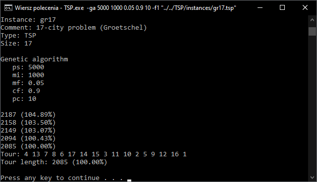

# TSP
Travelling Salesman Problem can be defined by the following question:

"Given a list of cities and the distances between each pair of cities, what is the shortest possible route that visits each city exactly once and returns to the origin city?"

## Implemented algorithms
- Greedy
- Repetitive greedy
- Brute force
- Simulated annealing
- Genetic

## Instance loading
Instance to solve can be loaded in two ways:
- As matrix (faster, but needs more memory)
- As coords (slower, but needs very little memory) (not available for explicit-type instances)

Loading instance as coords enables loading big instances (e.g. pla85900.tsp or bigger), as matrix representation of such instances could exhaust available memory.

## Technical details
Instance file must be in TSPLIB format.

## Images

